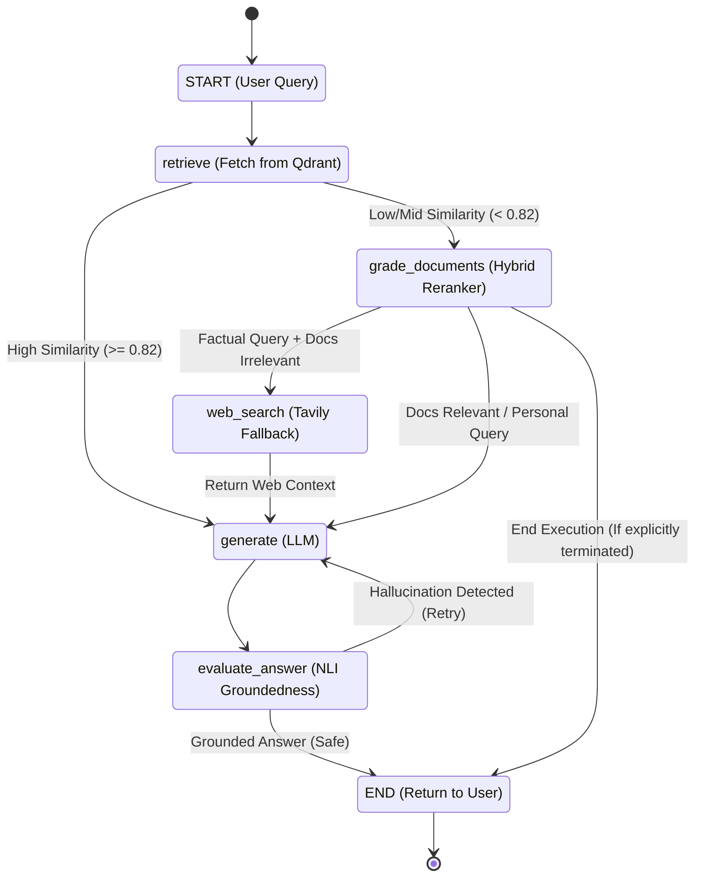

---
title: Support Docs Copilot
emoji: 🤖
colorFrom: blue
colorTo: indigo
sdk: docker
pinned: false
license: mit
---

# ?? Support Docs Copilot

[](https://huggingface.co/spaces/vineet88/support-docs-copilot)
[](https://aws.amazon.com)
[](https://codecov.io/gh/Vineetiitg/Agentic-Support-Copilot)

A lightweight, production-ready advanced RAG support copilot featuring **speculative retrieval with similarity-based routing** (DeepSeek / Gemini / OpenRouter), **Qdrant hybrid retrieval**, **Cohere & FlashRank reranking**, **Redis semantic caching & session memory**, **Arq asynchronous background workers**, and a **LangGraph Self-RAG agent** with confidence scoring, query rewriting, input/output guardrails, and RAGAS benchmark evaluation.


## ?? Demo & Previews

<div align="center">
  <!-- TODO: Replace with actual GIF link when uploaded -->
  
  <p><em>The Core Chat Experience: Real-time streaming with source citations.</em></p>
</div>

<details>
<summary><b>View More Screenshots</b></summary>
<br/>
<div align="center">
  <!-- TODO: Replace with Admin Dashboard clip -->
  
  <p><em>Admin Dashboard: Live Session Observability.</em></p>
  
  <!-- TODO: Replace with RAGAS Evaluation Tab screenshot -->
  
  <p><em>RAGAS Evaluation Tab: Rigorous LLM Benchmarking.</em></p>
  
  <!-- TODO: Replace with Dark Mode UI screenshot -->
  
  <p><em>Dark Mode UI: Clean, modern React frontend.</em></p>
</div>
</details>

## ? Key Features

- ? **Speculative Retrieval:** Routes requests dynamically across specialized models.
- ? **Semantic Caching:** Sub-second cached responses dropping turnaround to ~15ms.
- ? **JWT Authentication:** Secure role-based access for admins and users.
- ? **Hallucination Fallback:** Self-RAG agent detects and retries hallucinated answers.
- ? **Hybrid Reranking:** Dense + Sparse embeddings with Cohere/FlashRank.
- ? **Async Background Workers:** Heavy ingestion tasks offloaded to Redis Arq.
- ? **Guardrails:** Real-time PII redaction and prompt injection protection.

---

## 📂 Project Structure

```
app/
├── routers/          # API route handlers (chat, admin, auth, sessions)
├── services/         # Business logic layer (chat, feedback)
├── engine/           # RAG pipeline (retrieval, reranking, caching, memory)
├── graph/            # LangGraph agentic workflow
├── guardrails/       # Input validation and output safety
├── auth/             # JWT auth with SQLite user store
├── core/             # Config, logging, LLM factory, dependencies
└── observability/    # Prometheus metrics and monitoring
tests/                # Unit, integration, and evaluation tests
ui/                   # Streamlit frontend with component architecture
```

## 🧩 Tech Stack


---

## 🏗️ System Architecture

```mermaid
flowchart TB
    subgraph Client["🖥️ Client Layer"]
        UI["React Chat UI (Vite + Tailwind + Zustand)<br/>Port 5173"]
    end

    subgraph API["âš¡ API Layer (FastAPI)"]
        Auth["JWT Auth + RBAC"]
        Guard["Input Guardrails<br/>Prompt Injection · Rate Limit"]
        Chat["/chat & /chat/stream Endpoints"]
        Admin["Admin Endpoints<br/>Ingest · Upload · Reset · Eval"]
    end

    subgraph Memory["âš¡ Cache & Async Queue"]
        Redis["Redis Session Memory<br/>Multi-Turn Coreference Resolution"]
        Worker["Arq Background Workers<br/>Async Task Processing"]
    end

    subgraph Agent["🧠 LangGraph Self-RAG Agent"]
        direction TB
        Rewrite["1. Query Rewriting<br/>Speculative Condensation"]
        Retrieve["2. Retrieve<br/>Qdrant Hybrid Search"]
        Rerank["3. Rerank Chunks<br/>Cohere API / FlashRank"]
        Grade["4. Grade Documents<br/>Relevance Filtering"]
        Generate["5. Generate Answer<br/>Multi-Tier LLM Routing"]
        Evaluate["6. Evaluate & Score<br/>Confidence Scoring & Groundedness"]
    end

    subgraph Storage["🗄️ Data Layer"]
        Qdrant["Qdrant Vector DB<br/>Dense + Sparse (BM25)"]
        Embed["FastEmbed ONNX<br/>CPU-Only Embeddings"]
    end

    subgraph Safety["🛡️ Output Safety"]
        Redact["PII Redaction<br/>SSN · CC · Email · Phone"]
    end

    subgraph Observe["📊 Observability & Benchmarks"]
        LangSmith["LangSmith Tracing"]
        Metrics["Latency & Confidence Metrics"]
        RAGAS["RAGAS Benchmarks<br/>Faithfulness · Relevancy"]
        Bench["HF Readiness Suite<br/>5-Case Golden Benchmark"]
    end

    UI -->|HTTP + Streaming| Auth
    Auth --> Guard
    Guard --> Chat
    Chat <-->|Session Context| Redis
    Chat --> Rewrite
    Rewrite --> Retrieve
    Retrieve <-->|Hybrid Query| Qdrant
    Embed -.->|Embeddings| Qdrant
    Retrieve --> Rerank
    Rerank --> Grade
    Grade -->|Relevant| Generate
    Grade -->|"All Irrelevant"| UI
    Generate --> Evaluate
    Evaluate -->|"Grounded (Score ≥ Threshold) ✅"| Redact
    Evaluate -->|"Hallucinated / Low Confidence 🔄"| Generate
    Redact --> UI
    Admin -->|Async Jobs| Worker
    Worker -->|Ingest / Process| Embed
    Chat -.-> LangSmith & Metrics
    Admin -.-> RAGAS & Bench
```



### Self-RAG Workflow (Cyclic Decision Graph)



---

## 🌟 Core Architectural Highlights

1. **Speculative Retrieval with Similarity-Based Routing:**
   - Routes requests dynamically across specialized models: fast path (`google/gemini-2.0-flash-lite-preview-02-05`), default reasoning (`deepseek/deepseek-v4-flash`), and complex problem solving (`deepseek/deepseek-r1`) via OpenRouter / AICredits.
2. **Redis Pre-Warmed Vector Cache & Session Memory:**
   - Features semantic caching that returns instant answers for common FAQs (**Sub-second cached responses via semantic similarity matching**, dropping turnaround from ~1,850ms to ~15–60ms).
   - Manages multi-turn conversation memory with coreference resolution for natural dialogue flow.
3. **Cohere & FlashRank Hybrid Reranking:**
   - Combines dense (`BAAI/bge-small-en-v1.5`) and sparse (`Qdrant/bm25`) embeddings with automatic reranking via **Cohere ClientV2** or local CPU-only **FlashRank**.
   - Replaces slow LLM relevance grading.
4. **Speculative Dual-Path Retrieval:**
   - Uses `asyncio.gather()` to execute multi-turn query condensation concurrently with raw vector search.
5. **Arq Asynchronous Background Workers:**
   - Heavy tasks such as document ingestion, chunking, and vector indexing are offloaded to Redis-backed **Arq workers**, keeping the API non-blocking and highly responsive.
6. **Answer Confidence Scoring:**
   - The Self-RAG pipeline calculates numerical confidence scores for every generated response, automatically triggering fallback generation or flagging low-confidence answers for review.

---

## 🌟 Why Scenario B? (Lightweight & Cloud-Ready)

This project is engineered to remove heavy GPU, PyTorch, and Ollama dependencies:
- **No Multi-GB Downloads:** Leverages API-based LLM inference, eliminating the need to host heavy weights locally.
- **Lightweight CPU Embeddings:** Uses ONNX-based `FastEmbed` for high-speed local vector embeddings without PyTorch bloat.
- **Free Tier Deployment Ready:** Small Docker image footprint (`~60% smaller`), easily deployable on hosting tiers like HuggingFace Spaces, Render, Railway, or Fly.io.

---

<details>
<summary><b>?? Quick Start (Click to expand)</b></summary>

## âš¡ Quick Start

1. Clone and install:
   ```bash
   git clone https://github.com/Vineetiitg/Agentic-Support-Copilot.git
   cd Agentic-Support-Copilot
   python -m venv venv
   source venv/bin/activate
   pip install -r requirements.txt
   ```
2. Setup environment:
   ```bash
   cp .env.example .env
   # Edit .env with your keys
   ```
3. Run with Docker Compose:
   ```bash
   docker compose up -d
   ```

</details>

<details>
<summary><b>?? Detailed Setup: Docker & Local (Click to expand)</b></summary>

## 🚀 How to Run the Project

You can run this project in two ways: **Option A (Docker Compose - Easiest)** or **Option B (Local Python Environment)**.

### Option A: Running with Docker Compose (Recommended)

1. **Configure Environment Variables:**
   Make sure your `.env` file exists in the root directory and contains your API keys:
   ```env
   PROJECT_NAME="Support Docs Copilot"
   OPENROUTER_API_KEY=your_api_key_here
   OPENROUTER_BASE_URL=https://aicredits.in/v1
   LLM_MODEL=deepseek/deepseek-v4-flash
   FAST_LLM_MODEL=google/gemini-2.0-flash-lite-preview-02-05
   SLOW_LLM_MODEL=deepseek/deepseek-r1
   
   # Vector Database & Retrieval Mode
   QDRANT_LOCATION=./qdrant_data
   COLLECTION_NAME=support_docs
   RETRIEVAL_MODE=dense
   RETRIEVAL_TOP_K=5
   
   # Reranking Config
   COHERE_API_KEY=your_cohere_key_here
   RERANKER_PROVIDER=auto
   RERANKER_MODEL=rerank-english-v3.0
   FLASHRANK_MODEL=ms-marco-TinyBERT-L-2-v2
   RERANKER_ENABLED=true
   RERANKER_TOP_N=3
   
   # Redis & Queue
   REDIS_URL=redis://redis:6379/0
   
   # Observability & Safety
   ENABLE_GUARDRAILS=true
   ENABLE_RAG_EVAL=false
   LANGCHAIN_TRACING_V2=true
   LANGCHAIN_PROJECT="Support Docs Copilot"
   ```

2. **Build and Start the Cluster:**
   ```bash
   docker-compose up --build -d
   ```
   *Or using Make:*
   ```bash
   make build
   make up
   ```

3. **Ingest Sample Documentation:**
   Once the cluster is running, ingest the knowledge base documents into Qdrant:
   ```bash
   docker exec -it $(docker-compose ps -q backend) python -m app.engine.ingestion ingest
   ```
   *Or using Make:*
   ```bash
   make ingest
   ```

4. **Access the Application:**
   - 💬 **React Chat UI (Vite + Tailwind + Zustand):** Open [http://localhost:5173](http://localhost:5173) in your browser.
   - âš¡ **FastAPI Backend & Swagger Docs:** Open [http://localhost:8000/docs](http://localhost:8000/docs).
   - 🗄️ **Qdrant Dashboard:** Open [http://localhost:6333/dashboard](http://localhost:6333/dashboard).

---

### Option B: Running Locally with Python (Without Docker)

1. **Start Qdrant & Redis:**
   Start Qdrant (`docker run -p 6333:6333 qdrant/qdrant`) and Redis (`docker run -p 6379:6379 redis:7-alpine`). Alternatively, configure `QDRANT_LOCATION=./qdrant_data` in `.env` for local disk storage.

2. **Activate Virtual Environment & Install Dependencies:**
   ```bash
   python -m venv venv
   venv\Scripts\activate      # On Windows
   # source venv/bin/activate # On macOS/Linux
   pip install -r requirements.txt
   ```

3. **Ingest Sample Documents:**
   ```bash
   python -m app.engine.ingestion ingest
   ```

4. **Start the Backend API Server:**
   In your first terminal:
   ```bash
   uvicorn app.main:app --reload --port 8000
   ```

5. **Start the Streamlit Frontend UI:**
   In a second terminal (with virtual environment activated):
   ```bash
   cd frontend && npm run dev
   ```

---

</details>

## 📊 Running Benchmarks & Latency Tests

To test the system across all 5 architectural scenarios (cache hits, reranking speedups, speculative dual-path retrieval, and RAGAS evaluation analysis), execute the deep dry run benchmark suite:

```bash
python benchmark.py
```
*Or inside the Docker container:*
```bash
docker exec -it $(docker-compose ps -q backend) python benchmark.py
```

---

## 🛠️ Makefile Commands

```bash
make build       # Build lightweight Docker images
make up          # Start Qdrant, Redis, Backend API, Arq Worker, and React UI
make ingest      # Ingest documentation into Qdrant inside the container
make test        # Run pytest test suite inside the container
make eval        # Run RAGAS evaluation against golden dataset
make benchmark   # Run the 5-case architectural latency & readiness benchmark
make logs        # View live cluster logs
make down        # Tear down cluster and free ports
```

---

## 🔐 Authentication & Guardrails

- **JWT Authentication:** Protected endpoints require OAuth2 Bearer Tokens. Authenticate via `/auth/login` (default test accounts: `admin / admin123` and `user / user123`).
- **Input Guardrails:** Automatically inspects incoming prompts for injection attacks and enforces rate limiting (30 req/min).
- **Output Guardrails:** Automatically scrubs and redacts Personally Identifiable Information (SSNs, credit card numbers, phone numbers, emails) before delivering answers to the client.


