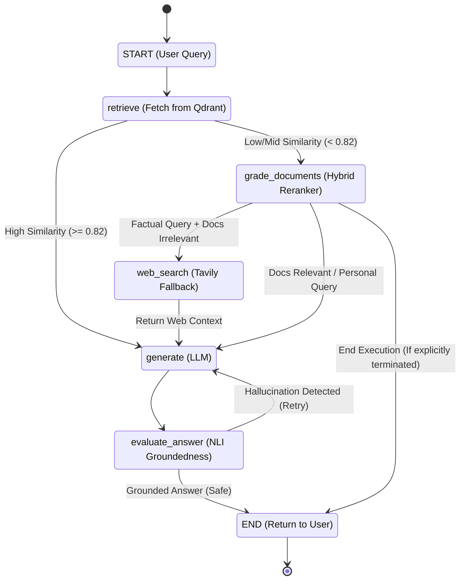

# LangGraph Architecture Flow

This diagram visualizes the exact state graph running in `app/graph/workflow.py`.

```mermaid
stateDiagram-v2
    %% Define Nodes
    START: START (User Query)
    Retrieve: retrieve (Fetch from Qdrant)
    GradeDocs: grade_documents (Hybrid Reranker)
    WebSearch: web_search (Tavily Fallback)
    Generate: generate (LLM)
    Evaluate: evaluate_answer (NLI Groundedness)
    END: END (Return to User)

    %% Flow Definitions
    [*] --> START
    START --> Retrieve
    
    %% Optimistic Routing
    Retrieve --> Generate: High Similarity (>= 0.82)
    Retrieve --> GradeDocs: Low/Mid Similarity (< 0.82)

    %% Intent & Relevance Routing
    GradeDocs --> WebSearch: Factual Query + Docs Irrelevant
    GradeDocs --> Generate: Docs Relevant / Personal Query
    GradeDocs --> END: End Execution (If explicitly terminated)

    WebSearch --> Generate: Return Web Context

    %% Generation & Hallucination Checking
    Generate --> Evaluate
    
    Evaluate --> Generate: Hallucination Detected (Retry)
    Evaluate --> END: Grounded Answer (Safe)
    
    END --> [*]
```
